# MAD Delivery — নতুন ফিচারের সহজ গাইড (বাংলা)

> **কার জন্য:** Robin এবং যেকোনো non-technical টিম মেম্বার, যিনি নতুন ফিচারগুলো চালু করে নিজে হাতে পরীক্ষা করবেন।
>
> **কোন কাজগুলো এখানে আছে:** দুই রাউন্ডের কাজ একসাথে।
> - রাউন্ড ১ (`brands-hours-statuses`): Brands, ব্রাঞ্চের সময় (hours), অর্ডার স্ট্যাটাসের নতুন নিয়ম।
> - রাউন্ড ২ (`reviews-complaints-addresses`): Delivery Areas, My Addresses, Product Reviews, Complaints, ছবি আপলোডের নতুন ঘর, ডার্ক মোডে Notifications, "সময় না থাকলে বন্ধ" নিয়ম, Night Pickup Points, আর কিছু পরিষ্কারের কাজ।
>
> **শেষ হালনাগাদ:** ৮ অক্টোবর ২০২৬
>
> বাটন, মেনু আর পেজের নাম ইংরেজিতেই রাখা হয়েছে, কারণ অ্যাপে আপনি ঠিক এই নামগুলোই দেখবেন।
> ছবিগুলো নতুন করে সেটআপ করা ডেমো ডাটা থেকে নেওয়া। আপনার মেশিনের ডাটা আলাদা হবে, তাই নাম, সংখ্যা আর তারিখ নাও মিলতে পারে।

---

## সূচিপত্র

1. [আপনার কম্পিউটারে আপডেট চালু করা (Windows)](#১-আপনার-কম্পিউটারে-আপডেট-চালু-করা-windows)
2. [এই এরর দেখলে কী করবেন](#২-এই-এরর-দেখলে-কী-করবেন)
3. [রোল ও ডেমো অ্যাকাউন্ট](#৩-রোল-ও-ডেমো-অ্যাকাউন্ট)
4. [Brands (ব্র্যান্ড)](#৪-brands-ব্র্যান্ড)
5. [Branch hours (ব্রাঞ্চের অর্ডার নেওয়ার সময়)](#৫-branch-hours-ব্রাঞ্চের-অর্ডার-নেওয়ার-সময়)
6. [অর্ডার স্ট্যাটাসের ধাপ (ডেলিভারি ও পিকআপ)](#৬-অর্ডার-স্ট্যাটাসের-ধাপ-ডেলিভারি-ও-পিকআপ)
7. [Delivery Areas (ডেলিভারি এলাকা)](#৭-delivery-areas-ডেলিভারি-এলাকা)
8. [My Addresses ও ম্যাপে ঠিকানা বাছাই](#৮-my-addresses-ও-ম্যাপে-ঠিকানা-বাছাই)
9. [Product Reviews (খাবারের রিভিউ)](#৯-product-reviews-খাবারের-রিভিউ)
10. [Complaints (অভিযোগ)](#১০-complaints-অভিযোগ)
11. [ছবি আপলোডের নতুন ঘর](#১১-ছবি-আপলোডের-নতুন-ঘর)
12. [Notifications (ডার্ক মোডসহ)](#১২-notifications-ডার্ক-মোডসহ)
13. [হোমপেজ: Call to order, Operating Hours, Night Pickup Points](#১৩-হোমপেজ-call-to-order-operating-hours-night-pickup-points)
14. [অন্যান্য ছোট পরিবর্তন](#১৪-অন্যান্য-ছোট-পরিবর্তন)
15. [জানা সীমাবদ্ধতা, স্থগিত কাজ ও আগে থেকেই ফেল করা টেস্ট](#১৫-জানা-সীমাবদ্ধতা-স্থগিত-কাজ-ও-আগে-থেকেই-ফেল-করা-টেস্ট)

---

## ১. আপনার কম্পিউটারে আপডেট চালু করা (Windows)

> ### ⚠️ আগে এটুকু পড়ুন: কিছু ধাপ আপনার ডাটা বদলে দেয়
>
> - **ধাপ ৬ (`migrate deploy`)** আপনার মেশিনের **সব Delivery Area মুছে দেয়**। এরপর কোনো ব্রাঞ্চ ডেলিভারি নেবে না, যতক্ষণ না ধাপ ৭ চালান বা নিজে এলাকা আঁকেন।
>   একই ধাপে: একজন কাস্টমারের একই খাবারে একাধিক রিভিউ থাকলে শুধু সবচেয়ে নতুনটা থাকে; পুরনো "time slot" টেবিল মুছে যায়; "Delayed" অবস্থার অর্ডার "On the Way" হয়ে যায়।
> - **ধাপ ৮ (`npm run seed`, ঐচ্ছিক)** ডেমো অ্যাকাউন্ট আর ডেমো ব্রাঞ্চের কিছু তথ্য (যেমন ম্যাপের অবস্থান) আবার ডিফল্টে ফিরিয়ে দেয়। দরকার না হলে চালাবেন না।
> - **কখনো `npx prisma migrate reset` চালাবেন না।** এটা পুরো ডাটাবেস মুছে ফেলে।
> - তাই **ধাপ ২-এর ব্যাকআপ বাদ দেবেন না।**

সব কমান্ড প্রজেক্টের ফোল্ডারে খোলা টার্মিনালে (Command Prompt বা PowerShell) চালাবেন। প্রতিটা কমান্ডের নিচে এক লাইনে লেখা আছে সেটা কী করে।

**ধাপ ১: ডেভ সার্ভার বন্ধ করুন**

যে টার্মিনালে `npm run dev` চলছে, সেখানে `Ctrl + C` চাপুন।
এটা চালু থাকলে Windows-এ পরের ধাপগুলোতে Prisma ফাইল আটকে যায়।

**ধাপ ২: ডাটাবেসের ব্যাকআপ নিন**

```
mkdir backups
copy prisma\dev.db backups\dev.db.before-update-2026-10-08.bak
```
প্রথম লাইন `backups` ফোল্ডার বানায় (আগে থেকে থাকলে "already exists" বলবে, সমস্যা নেই)। দ্বিতীয় লাইন আপনার ডাটাবেসের একটা কপি রাখে। `backups` ফোল্ডার কখনো git-এ commit করবেন না।

**ধাপ ৩: নিজের কাজ নিরাপদে রাখুন, তারপর `main`-এ যান**

```
git status
git checkout main
```
`git status` দেখায় আপনার কোনো না-সেভ করা পরিবর্তন আছে কি না। থাকলে আগে নিজের branch-এ commit করুন (অথবা `git stash`)। তারপর `git checkout main` আপনাকে `main` branch-এ নিয়ে যায়।

**ধাপ ৪: নতুন কোড নামান**

```
git pull origin main
```
GitHub থেকে `main`-এর সর্বশেষ কোড আপনার মেশিনে আনে।

**ধাপ ৫: প্যাকেজ আপডেট করুন**

```
npm install
```
দরকারি প্যাকেজ ঠিক করে এবং নতুন ডাটাবেস কাঠামোর জন্য Prisma client বানায়। নতুন কোনো প্যাকেজ যোগ হয়নি, তবু এটা চালাতে হবে।

**ধাপ ৬: ডাটাবেস আপডেট (migration) চালান** ⚠️ ডাটা বদলায়

```
npx prisma migrate deploy
```
আপনার `dev.db`-তে যেসব আপডেট এখনো চলেনি শুধু সেগুলো চালায়। এই দুই রাউন্ডে মোট ৮টা:

| Migration | সহজ কথায় কী করে |
|---|---|
| `20261007120000_brands_as_data` | ব্র্যান্ডকে ডাটাবেসের তালিকা বানায় (Cheez! Pizza, Madchef)। কিছু মোছে না। |
| `20261007130000_brand_hours_schedule` | পুরনো খোলা/বন্ধের সময়কে ব্র্যান্ড অনুযায়ী নতুন সময়সূচিতে বদলায়, আগের মতোই আচরণ রেখে। |
| `20261007140000_order_status_flow` | "Delayed" অবস্থার অর্ডারকে "On the Way" করে। |
| `20261008100000_one_delivery_area_per_branch` | ⚠️ **সব Delivery Area মুছে দেয়** (পুরনোগুলো টেস্ট ডাটা ছিল)। অর্ডারে যে এলাকার নাম, চার্জ, সময় লেখা ছিল সেগুলো থেকে যায়। এরপর প্রতি ব্রাঞ্চে একটাই এলাকা। |
| `20261008110000_product_reviews` | রিভিউকে "এক কাস্টমার, এক খাবার, এক রিভিউ" বানায়; ডুপ্লিকেট থাকলে নতুনটা রাখে। ছবি আর মডারেশনের ঘর যোগ করে। |
| `20261008120000_complaint_photos` | অভিযোগে ছবির ঘর যোগ করে। কিছু মোছে না। |
| `20261008130000_backfill_unset_brand_hours` | যে চালু ব্রাঞ্চ-ব্র্যান্ডের কোনো সময় দেওয়া নেই, তাকে "সারাদিন খোলা" সময় দেয়, যাতে আজ যা খোলা তা হঠাৎ বন্ধ না হয়। |
| `20261008140000_drop_delivery_time_slots` | অব্যবহৃত পুরনো "time slot" টেবিল মুছে দেয়। |

**ধাপ ৭: ডেমো ব্রাঞ্চগুলোকে ডিফল্ট ডেলিভারি এলাকা দিন**

```
npx tsx prisma/seed-delivery-areas.ts
```
Main Branch, Cheez Gulshan আর Madchef Dhanmondi-কে ৫ কিমি-র একটা বৃত্ত এলাকা দেয় (চার্জ ৳৬০, সময় ৪৫ মিনিট), যদি ব্রাঞ্চের ম্যাপ পিন থাকে আর এলাকা না থাকে। অন্য কিছুতে হাত দেয় না।
বাকি ব্রাঞ্চের এলাকা Super Admin বা সেই ব্রাঞ্চের Manager নিজে আঁকবেন (অধ্যায় ৭)।

**ধাপ ৮ (ঐচ্ছিক): পুরো ডেমো ডাটা আবার বসান** ⚠️ ডেমো ডাটা বদলায়

```
npm run seed
```
ডেমো অ্যাকাউন্ট, ডেমো ব্রাঞ্চ, ডেমো সময়সূচি ইত্যাদি বসায়। শেষে টার্মিনালে ডেমো পাসওয়ার্ড দেখায়।
আপনার নিজের বানানো ডাটা মোছে না, তবে ডেমো ব্রাঞ্চের লোকেশনের মতো কিছু তথ্য ডিফল্টে ফেরায়। শুধু ডেমো অ্যাকাউন্ট না থাকলে বা ডাটা গোলমেলে হলে চালান।

**ধাপ ৯: ডেভ সার্ভার আবার চালু করুন**

```
npm run dev
```
অ্যাপ চালু করে। ব্রাউজারে `http://localhost:3000` খুলুন।

**ধাপ ১০: দ্রুত যাচাই**

- Super Admin দিয়ে লগইন করে **Delivery Areas** খুলুন: প্রতি ব্রাঞ্চের একটা করে সারি দেখাবে।
- Customer দিয়ে **Addresses** খুলুন: **New Address** চাপলে **Pick on map** আর **Enter manually** দুটো ট্যাব দেখাবে।
- হোমপেজে নিচে **Operating Hours** অংশ দেখাবে।

**নিজের branch-এ ফিরতে চাইলে:** `git checkout <আপনার-branch-এর-নাম>`, তারপর `git merge main` দিলে নতুন কোড আপনার branch-এও আসবে। (ডাটাবেস একটাই, তাই migration আবার চালাতে হবে না।)

**E2E টেস্ট চালাতে চাইলে (ঐচ্ছিক):** `npm run build`, তারপর `npm run test:e2e:prepare`, তারপর `npm run test:e2e`। এগুলো আলাদা `prisma\test.db` ব্যবহার করে, আপনার `dev.db`-তে হাত দেয় না।

---

## ২. এই এরর দেখলে কী করবেন

| আপনি যা দেখছেন | কেন হচ্ছে | কী করবেন |
|---|---|---|
| `EPERM: operation not permitted, rename ... query_engine-windows.dll.node` | ডেভ সার্ভার (বা অন্য কোনো `node`) এখনো চলছে, Prisma ফাইলটা আটকে আছে | সব টার্মিনালে `Ctrl + C` দিন, তারপর `npx prisma generate`, তারপর আবার `npm run dev` |
| `error: Your local changes to the following files would be overwritten by checkout` | আপনার না-সেভ করা পরিবর্তন আছে | নিজের branch-এ commit করুন, অথবা `git stash`, তারপর আবার `git checkout main` |
| `npx prisma migrate deploy` চালাতে গিয়ে কোনো লাল এরর | আপনার ডাটায় অপ্রত্যাশিত কিছু আছে | **আর কিছু চালাবেন না।** ব্যাকআপ ফেরত দিন: `copy backups\dev.db.before-update-2026-10-08.bak prisma\dev.db` এবং এররের পুরো লেখা Ash-কে পাঠান |
| `npm run build` বা টাইপ চেকে `Cannot find module ... time-slots` | পুরনো build-এর ফাইল রয়ে গেছে | `.next-e2e` ফোল্ডার মুছে দিন। Command Prompt: `rmdir /s /q .next-e2e` · PowerShell: `Remove-Item -Recurse -Force .next-e2e` |
| `Port 3000 is in use` | আগের সার্ভার এখনো চলছে | পুরনো টার্মিনাল বন্ধ করুন, বা অন্য পোর্টে চালান: `npm run dev -- -p 3001` |
| কাস্টমার অর্ডার দিতে পারছেন না, লেখা আসছে "No hours set, closed to customers" | ঐ ব্রাঞ্চে ঐ ব্র্যান্ডের সময় দেওয়া নেই। এখন সময় না থাকা মানে বন্ধ | Branch Manager → **Delivery Hours** এ সময় দিন (অধ্যায় ৫) |
| কোনো ব্রাঞ্চই ডেলিভারি নিচ্ছে না, শুধু pickup | migration সব এলাকা মুছেছে, নতুন আঁকা হয়নি | ধাপ ৭ চালান, অথবা **Delivery Areas** থেকে এলাকা আঁকুন (অধ্যায় ৭) |
| ম্যাপে পিন রাখলে ঠিকানা নিজে নিজে ভরছে না, বা সার্চে কিছু আসছে না | `.env.local`-এ `BARIKOI_API_KEY` নেই | Ash-এর কাছ থেকে key নিয়ে `.env.local`-এ বসান। key ছাড়াও ঠিকানা হাতে লিখে সেভ করা যায় |
| "Use my current location" চাপলে কিছু হয় না | ব্রাউজার লোকেশনের অনুমতি দেয়নি | ঠিকানার বারের বাঁ দিকের তালা আইকনে গিয়ে Location "Allow" করুন |

---

## ৩. রোল ও ডেমো অ্যাকাউন্ট

অ্যাপে ৭ ধরনের ব্যবহারকারী (role) আছে। প্রত্যেকে লগইন করলে বাঁ দিকের মেনুতে (sidebar) শুধু নিজের কাজের পেজ দেখেন।

| রোল | ডেমো username | কী করেন (এই গাইডের সাথে সম্পর্কিত অংশ) |
|---|---|---|
| Super Admin | `super_admin` | সব কিছু: Brands, Branches, সব ব্রাঞ্চের Delivery Areas ও hours, রিভিউ লুকানো, অভিযোগ দেখা, Override status |
| Management | `management` | রিপোর্ট আর অপারেশন দেখা (এই গাইডের ফিচারে বিশেষ ভূমিকা নেই) |
| Marketing | `marketing` | **Product Reviews** মডারেশন (Hide / Restore), flag করা রিভিউ দেখা |
| Branch Manager | `branch_manager` | নিজের ব্রাঞ্চ (ডেমোতে **Main Branch**): অর্ডার চালানো, Delivery Hours, Delivery Area, রিভিউ flag, অভিযোগ সামলানো |
| Accounts | `accounts` | হিসাব-নিকাশ (এই গাইডের ফিচারে বিশেষ ভূমিকা নেই) |
| Rider | `rider` | ডেলিভারি: Picked Up → On the Way → Delivered |
| Customer | `customer` | অর্ডার, ঠিকানা, রিভিউ, অভিযোগ |

- লগইন পেজে username, ইমেইল বা ফোন নম্বর দিয়ে ঢোকা যায়।
- **পাসওয়ার্ড:** সব ডেমো অ্যাকাউন্টের পাসওয়ার্ড একই। `npm run seed` চালানোর শেষে টার্মিনালে দেখায়, আর `docs/HANDOVER.md`-এর "Demo accounts" অংশেও লেখা আছে।
- একসাথে দুই রোল পরীক্ষা করতে একটা সাধারণ উইন্ডো আর একটা Incognito উইন্ডো ব্যবহার করুন (আলাদা লগইন থাকবে)।

---

## ৪. Brands (ব্র্যান্ড)

### কী ও কেন
আগে "Cheez! Pizza" আর "Madchef" নাম, রং, লোগো কোডের ভেতরে লেখা ছিল। নতুন ব্র্যান্ড যোগ করতে ডেভেলপার লাগত। এখন ব্র্যান্ড একটা তালিকা, যা Super Admin নিজেই চালান। অ্যাপের যেখানে যেখানে ব্র্যান্ড দেখায় (হোমপেজ, মেনু ট্যাব, প্রোডাক্ট কার্ড, ফিল্টার) সব এই তালিকা থেকে পড়ে।

### কে, কোথায়
- **Super Admin** → বাঁ মেনু → **Products** অংশে **Brands**
- কোন ব্রাঞ্চ কোন ব্র্যান্ড বিক্রি করে: **Branches** → ব্রাঞ্চ খুলুন → **Edit** → ব্র্যান্ডের চেকবক্স
- অন্য রোলরা ব্র্যান্ড দেখতে পান, বদলাতে পারেন না

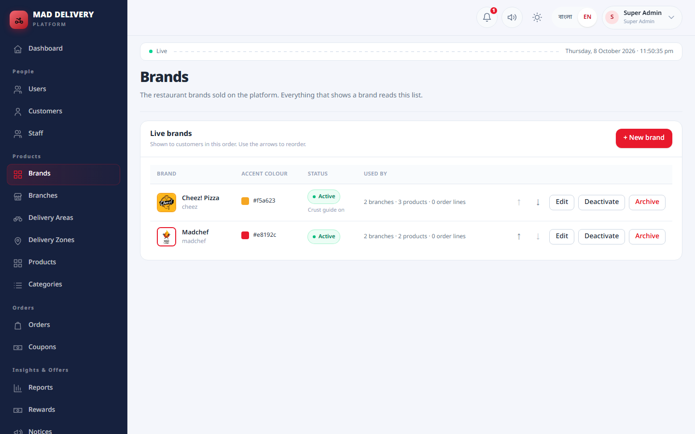

### ধাপে ধাপে
1. **Brands** পেজে প্রতিটা ব্র্যান্ডের সারিতে রং, অবস্থা (Active/Inactive) আর কতগুলো ব্রাঞ্চ ও প্রোডাক্ট ব্যবহার করছে তা দেখবেন।
2. নতুন ব্র্যান্ড: **+ New brand** → নাম, বাংলা নাম, Key (একবার দিলে আর বদলানো যায় না), Accent colour, ছোট বিবরণ, Tagline, লোগো → **Create brand**।
3. বদলাতে: সারির **Edit** → বদলান → সেভ।
4. সাময়িক বন্ধ: **Deactivate** (কাস্টমার আর দেখবে না)। আবার চালু: **Activate**।
5. পুরোপুরি সরাতে: **Archive** (ইতিহাস থাকে)। যে ব্র্যান্ড কখনো ব্যবহার হয়নি শুধু সেটাই **Delete** করা যায়।
6. হোমপেজে কোন ব্র্যান্ড আগে দেখাবে: সারির ↑ ↓ তীর।
7. পিৎজার "Crust & size guide" শুধু সেই ব্র্যান্ডে দেখায় যার ফর্মে এই সুইচ চালু।

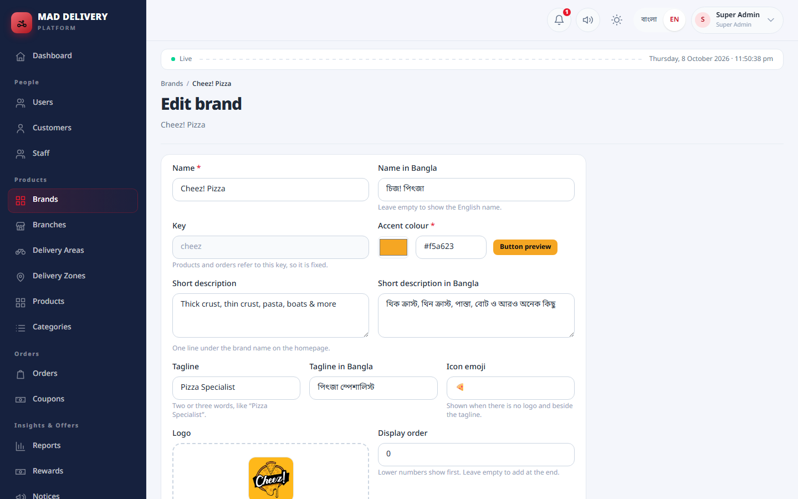

### সব জায়গায় কীভাবে মেলে
ব্র্যান্ডের নাম, রং বা লোগো বদলালে পেজ রিফ্রেশ করলেই হোমপেজ, মেনু ট্যাব, প্রোডাক্ট কার্ড, ড্যাশবোর্ডের ব্যাজ সব জায়গায় নতুনটা দেখায়। প্রতিটা অর্ডার লাইনে কোন ব্র্যান্ডে বিক্রি হয়েছিল সেটা লেখা থাকে, তাই পরে ব্র্যান্ড বদলালেও পুরনো অর্ডার ঠিক থাকে। প্রতিটা পরিবর্তন **Activity Logs**-এ ওঠে।

### টেস্ট চেকলিস্ট
1. Super Admin → **Brands**: Cheez! Pizza ও Madchef দেখা যাচ্ছে। **প্রত্যাশিত:** দুটোই Active।
2. Madchef **Edit** → Accent colour বদলে সেভ → হোমপেজ রিফ্রেশ। **প্রত্যাশিত:** Madchef-এর রং নতুন।
3. Madchef **Deactivate** → লগআউট অবস্থায় হোমপেজ। **প্রত্যাশিত:** Madchef মেনু ট্যাব নেই। পরীক্ষা শেষে **Activate**।
4. **+ New brand** দিয়ে একটা টেস্ট ব্র্যান্ড বানান, কোনো প্রোডাক্ট না দিয়ে **Delete**। **প্রত্যাশিত:** মুছে যায়।
5. **যা হওয়া উচিত নয়:** Branch Manager দিয়ে লগইন করলে মেনুতে **Brands** থাকবে না, আর সরাসরি `/admin/brands` খুললে ঢুকতে দেবে না।
6. **যা হওয়া উচিত নয়:** যে ব্র্যান্ডের প্রোডাক্ট বা অর্ডার আছে, তার জন্য **Delete** অপশন থাকবে না, শুধু **Archive**।
7. **যা হওয়া উচিত নয়:** কোনো ব্রাঞ্চে ঐ ব্র্যান্ডের চালু প্রোডাক্ট থাকলে ব্রাঞ্চ থেকে ব্র্যান্ডটা সরানো যাবে না (পরিষ্কার এরর মেসেজ আসবে)।

---

## ৫. Branch hours (ব্রাঞ্চের অর্ডার নেওয়ার সময়)

### কী ও কেন
প্রতি ব্রাঞ্চে প্রতি ব্র্যান্ডের নিজের সময়সূচি, আর ডেলিভারি ও পিকআপের সময় আলাদা হতে পারে। যেমন Cheez রাত ১১টা পর্যন্ত ডেলিভারি + পিকআপ, তারপর ভোর ৪টা পর্যন্ত শুধু ডেলিভারি। সব সময় ঢাকার সময় (Asia/Dhaka)।

**নতুন নিয়ম (রাউন্ড ২): সময় না দেওয়া থাকলে ঐ ব্র্যান্ড ঐ ব্রাঞ্চে বন্ধ।** আগে সময় না থাকা মানে ছিল "সবসময় খোলা"। এখন নতুন ব্রাঞ্চ খুললে আগে সময় দিতে হবে, নইলে কাস্টমার অর্ডার করতে পারবে না। আর অ্যাপ জোরে সতর্ক করবে।

### কে, কোথায়
- **Branch Manager** (শুধু নিজের ব্রাঞ্চ) → বাঁ মেনু → **Delivery Operations** অংশে **Delivery Hours**
- **Super Admin** (যেকোনো ব্রাঞ্চ) → **Branches** → ব্রাঞ্চ খুলুন → "Ordering hours today" সারির **Edit hours**

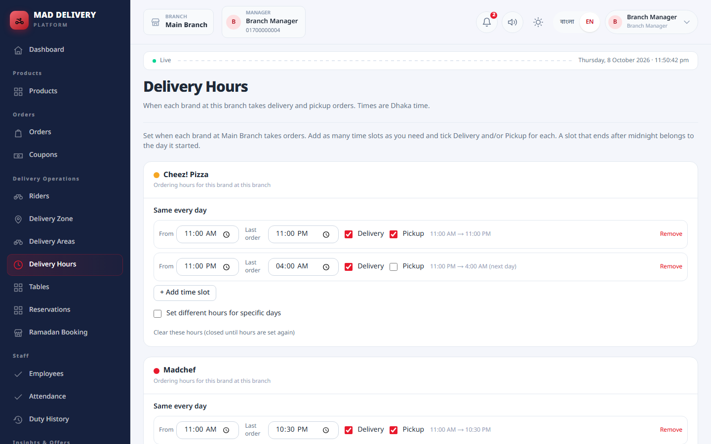

### ধাপে ধাপে
1. প্রতিটা ব্র্যান্ডের আলাদা কার্ড আছে। **Same every day** মানে প্রতিদিন একই সময়।
2. প্রতিটা সারি একটা "time slot": **From** (কখন থেকে), **Last order** (শেষ অর্ডার কখন), আর **Delivery** / **Pickup** টিক।
3. আরেকটা সময় যোগ করতে **+ Add time slot**। মধ্যরাত পার হওয়া সময় চলে (যেমন 11:00 PM → 4:00 AM), এটা যেদিন শুরু সেদিনের বলে ধরা হয়।
4. কোনো দিন আলাদা সময় চাইলে **Set different hours for specific days** টিক দিন, তারপর সেই দিনের সময় দিন।
5. **Save hours** চাপুন।
6. **Clear these hours (closed until hours are set again)** চাপলে ঐ ব্র্যান্ড আবার সময় না দেওয়া পর্যন্ত **বন্ধ** থাকবে।
7. Dine-in সময় (শুধু দেখানোর জন্য, অ্যাপ dine-in অর্ডার নেয় না) একই পেজের নিচে।

**সময় না থাকলে যে সতর্কবার্তা দেখাবেন:** ব্রাঞ্চের পেজে হলুদ ব্যানার "No hours set, closed to customers", Branch Manager-এর Dashboard-এ একই ব্যানার, Branches তালিকায় ব্যাজ। সবগুলোতে **Set hours** লিংক আছে।

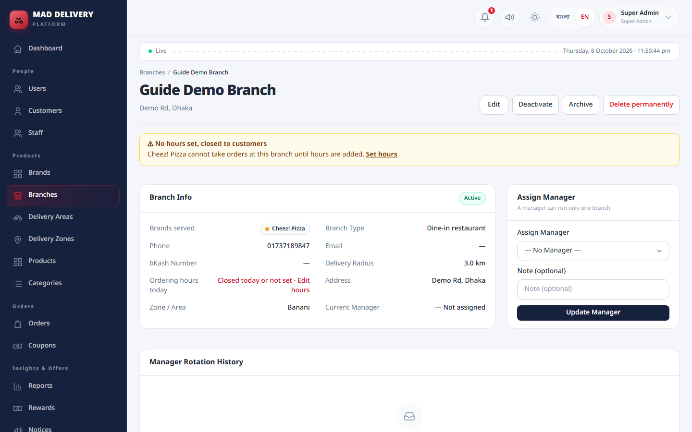

### সব জায়গায় কীভাবে মেলে
এই সময়সূচিই একমাত্র উৎস। চেকআউট, নিকটতম ব্রাঞ্চ বাছাই, হোমপেজের "Call to order" আর "Operating Hours", কার্ট সব এখান থেকে পড়ে। কোনো ব্র্যান্ড বন্ধ থাকলে মেনুতে ধূসর দেখায় আর "Opens at 11:00 AM" লেখা আসে। শুধু একটা চ্যানেল খোলা থাকলে (যেমন শুধু pickup) কার্টে বন্ধ বাটনটা নিষ্ক্রিয় থাকে আর কারণ লেখা থাকে। সার্ভারও আবার যাচাই করে, তাই পুরনো খোলা পেজ থেকেও বন্ধ সময়ে অর্ডার যায় না। প্রতিটা পরিবর্তন **Activity Logs**-এ ওঠে।

### টেস্ট চেকলিস্ট
1. Branch Manager → **Delivery Hours**: Cheez! Pizza আর Madchef-এর কার্ড দেখা যাচ্ছে। **প্রত্যাশিত:** সময়গুলো ১২ ঘণ্টার ফরম্যাটে (AM/PM)।
2. Madchef-এর Last order এখনকার সময়ের ১০ মিনিট আগে দিন → **Save hours** → Customer দিয়ে হোমপেজ। **প্রত্যাশিত:** Madchef ধূসর, "Opens tomorrow at …" জাতীয় লেখা।
3. ঐ অবস্থায় Customer কার্টে Madchef-এর খাবার রেখে চেকআউটের চেষ্টা করুন। **প্রত্যাশিত:** কারণসহ আটকে দেবে, ব্র্যান্ডের নাম বলবে। পরীক্ষা শেষে সময় আগের মতো করুন।
4. Super Admin দিয়ে একটা নতুন ব্রাঞ্চ বানান, সময় দেবেন না → ব্রাঞ্চের পেজ খুলুন। **প্রত্যাশিত:** হলুদ ব্যানার "No hours set, closed to customers"।
5. Super Admin → **Activity Logs**। **প্রত্যাশিত:** সময় বদলের লাইন, কে বদলেছেন সহ।
6. **যা হওয়া উচিত নয়:** Branch Manager অন্য কোনো ব্রাঞ্চের সময় বদলাতে পারবেন না।
7. **যা হওয়া উচিত নয়:** সময় না দেওয়া ব্রাঞ্চ থেকে কাস্টমার অর্ডার দিতে পারবেন না।
8. **যা হওয়া উচিত নয়:** একই দিনে দুটো সময় একটার ওপর আরেকটা পড়লে সেভ হবে না।

---

## ৬. অর্ডার স্ট্যাটাসের ধাপ (ডেলিভারি ও পিকআপ)

### কী ও কেন
আগে একই ধাপ ("On the Way") Branch Manager আর Rider দুজনেই চাপতে পারতেন, ফলে "Cannot move from On the Way" এরর আসত। এখন প্রতিটা ধাপের মালিক একজন:

| ধাপ | কে চাপেন |
|---|---|
| Pending → Accepted → Preparing → Ready for rider | Branch Manager (বা Super Admin) |
| Picked Up → On the Way → Delivered | **শুধু** যে Rider-কে অর্ডার দেওয়া হয়েছে |
| পিকআপ অর্ডার: Pending → Accepted → Preparing → Ready for collection → Collected | Branch Manager |

একই বাটন দুবার চাপলে (বা পুরনো পেজ থেকে চাপলে) কোনো এরর হয় না, কিছুই বদলায় না। Manager, Rider আর Super Admin-এর অর্ডার পেজ নিজে নিজে রিফ্রেশ হয়।
"Delayed" এখন আর আলাদা স্ট্যাটাস না। Rider-এর **Report Delay** বাটন কাস্টমারকে শুধু জানায় "কিছুক্ষণ দেরি হবে", স্ট্যাটাস On the Way-ই থাকে।

### কে, কোথায়
- **Branch Manager** → **Orders** → অর্ডার খুলুন
- **Rider** → **My Deliveries** (বা **New Orders**) → অর্ডার খুলুন
- **Customer** → **My Orders** → অর্ডার খুলুন (শুধু দেখা)
- **Super Admin** → **Orders** → অর্ডার খুলুন

### ধাপে ধাপে: ডেলিভারি অর্ডার
1. নতুন অর্ডার এলে Manager দেখবেন **Accept Order** আর **Cancel**।

   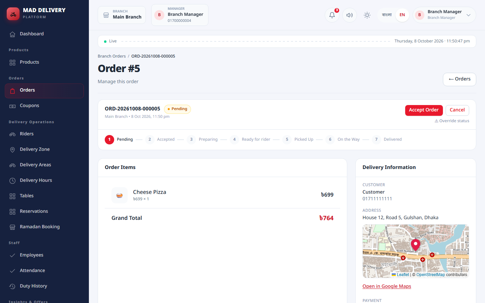

2. **Accept Order** → **Start Preparing**।
3. এর মধ্যেই (Accepted থেকে) Manager **Assign Rider** দিয়ে রাইডার দিতে পারেন, যাতে রাইডার রওনা দিতে পারেন। Pending অবস্থায় রাইডার দেওয়া যায় না।
4. খাবার তৈরি হলে **Mark Ready for rider**।

   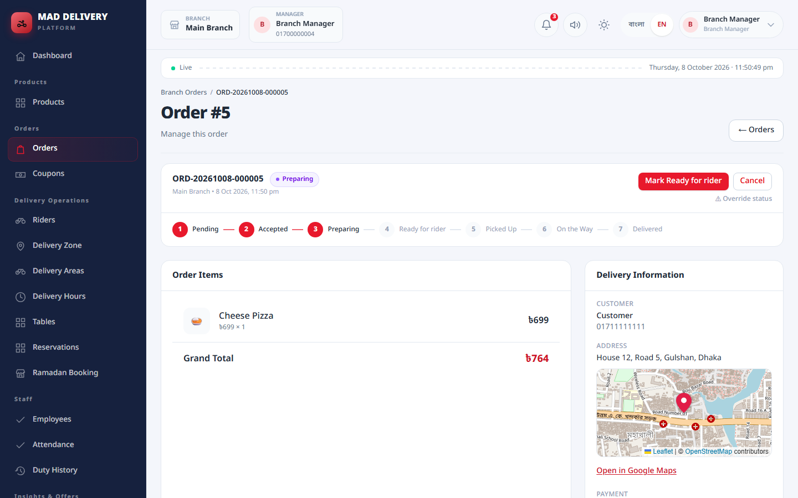

5. রাইডার অ্যাপে "New order assigned" জানালা দেখবেন → **Accept** (না পারলে **Reject**)।

   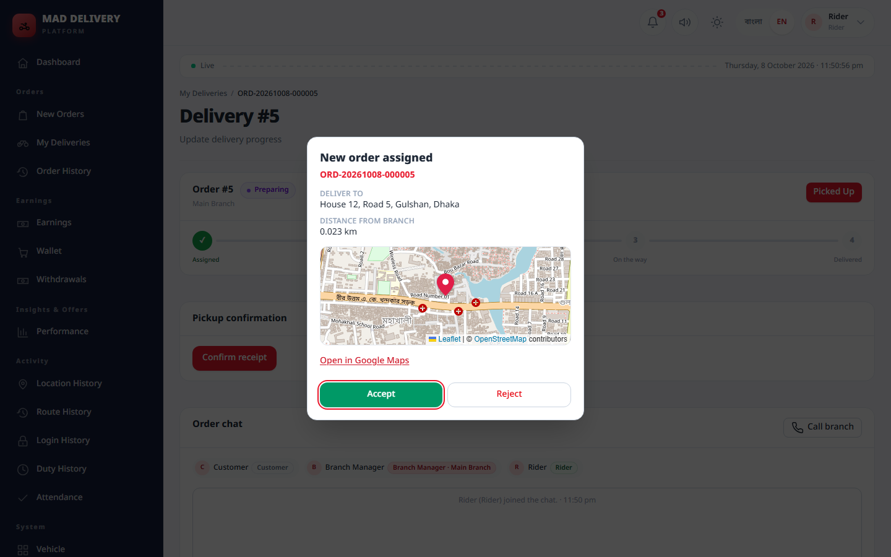

6. রাইডার খাবার হাতে পেলে **Picked Up** চাপেন। Ready হওয়ার আগেও চাপা যায় (তখন ধরে নেওয়া হয় খাবার রেডি ছিল)। আলাদা করে "Confirm receipt" চাপার দরকার নেই।
7. তারপর **On the Way**, পৌঁছে **Delivered**। দেরি হলে **Report Delay**।

   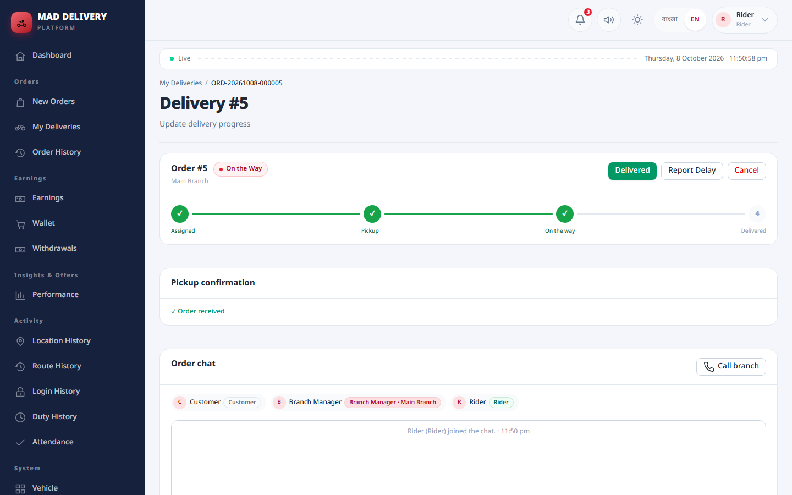

8. কাস্টমার নিজের অর্ডার পেজে প্রতিটা ধাপ লাইভ দেখেন।

   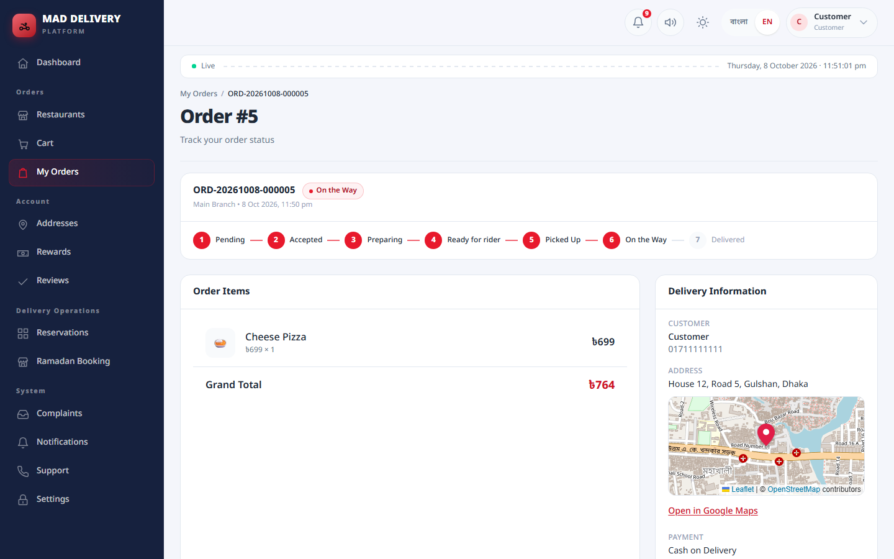

### ধাপে ধাপে: পিকআপ অর্ডার
1. Manager: **Accept Order** → **Start Preparing** → **Mark Ready for collection**।
2. কাস্টমার এসে নিলে **Mark Collected**। পিকআপ অর্ডারে রাইডারের কোনো ভূমিকা নেই।

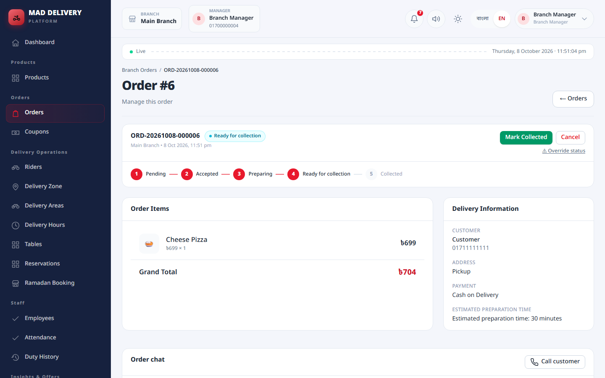

### জরুরি অবস্থায়: Override status
রাইডারের ফোন বন্ধ, বা Delivered চাপতে ভুলে গেছেন, এমন সময়ের জন্য।
1. অর্ডার পেজে ডান দিকে ছোট লিংক **Override status** (ইচ্ছে করে ছোট রাখা, যাতে সাধারণ কাজে কেউ না চাপেন)।
2. নতুন স্ট্যাটাস বাছুন, কারণ লিখুন (কমপক্ষে ৫ অক্ষর) → **Override**।
3. এটা **Activity Logs**-এ আর অর্ডারের ইতিহাসে আপনার নামসহ লেখা থাকে। Delivered-এ override করলে রাইডারের কমিশন ঠিকই পান।

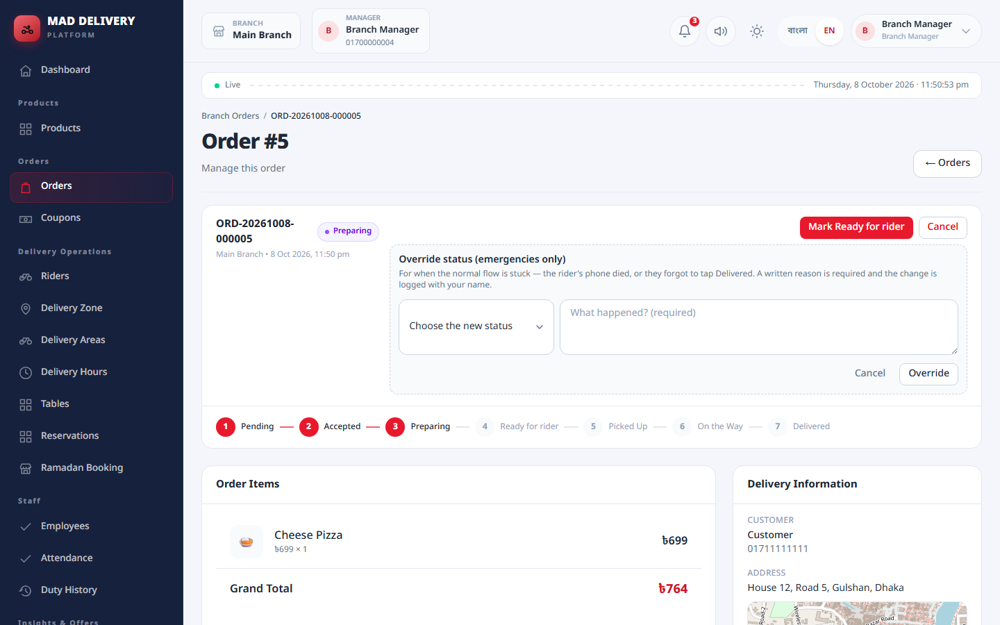

### সব জায়গায় কীভাবে মেলে
রাইডার কোনো ধাপ চাপলে কয়েক সেকেন্ডের মধ্যে Manager, Super Admin আর Customer-এর পেজ নিজে নিজে বদলায়। প্রতিটা ধাপে কাস্টমার নোটিফিকেশন পান। Delivered/Collected হলে রিভিউ দেওয়ার আমন্ত্রণ যায় (অধ্যায় ৯)।

### টেস্ট চেকলিস্ট
1. Customer দিয়ে Main Branch থেকে একটা ডেলিভারি অর্ডার দিন। Manager পেজ খুলুন। **প্রত্যাশিত:** **Accept Order** দেখা যায়।
2. Accepted অবস্থায় **Assign Rider** দিয়ে ডেমো রাইডার দিন। **প্রত্যাশিত:** সফল।
3. Manager-এর পেজ খোলা রেখে অন্য উইন্ডোতে রাইডার **Picked Up** চাপুন। **প্রত্যাশিত:** Manager-এর পেজ রিফ্রেশ ছাড়াই Picked Up দেখায়।
4. রাইডার **On the Way** → **Delivered**। **প্রত্যাশিত:** কাস্টমারের পেজে সব ধাপ লাল/সম্পূর্ণ।
5. একটা পিকআপ অর্ডার দিন, Manager দিয়ে শেষ পর্যন্ত **Mark Collected**। **প্রত্যাশিত:** কাস্টমারের পেজে "Collected"।
6. একটা অর্ডারে **Override status** → Delivered, কারণ লিখে। **প্রত্যাশিত:** স্ট্যাটাস বদলায়, **Activity Logs**-এ লাইন আসে।
7. **যা হওয়া উচিত নয়:** Manager-এর পেজে ডেলিভারি অর্ডারের জন্য "Picked Up / On the Way / Delivered" বাটন থাকবে না।
8. **যা হওয়া উচিত নয়:** Pending অবস্থায় রাইডার দেওয়া যাবে না।
9. **যা হওয়া উচিত নয়:** একই বাটন দুবার চাপলে "Cannot move from …" এরর আসবে না।
10. **যা হওয়া উচিত নয়:** কারণ না লিখে Override হবে না।

---

## ৭. Delivery Areas (ডেলিভারি এলাকা)

### কী ও কেন
প্রতিটা ব্রাঞ্চের **একটাই** ডেলিভারি এলাকা, ম্যাপে আঁকা। কাস্টমারের ঠিকানার পিন এলাকার ভেতরে পড়লে ঐ ব্রাঞ্চ ডেলিভারি দেয়। এলাকার আলাদা নাম নেই (ব্রাঞ্চের নামই এলাকার নাম), "Day/Night shift" নেই (কখন ডেলিভারি হবে সেটা Delivery Hours ঠিক করে)।
নতুন: **Temporary blocks**। রাস্তা বন্ধ, পানি জমা বা কোনো অনুষ্ঠানের কারণে এলাকার একটা অংশ কিছু সময়ের জন্য বন্ধ রাখা যায়। ঐ অংশের ঠিকানা তখন শুধু pickup পায়।

### কে, কোথায়
- **Super Admin** (সব ব্রাঞ্চ) → বাঁ মেনু → **Products** অংশে **Delivery Areas** → ব্রাঞ্চের সারিতে **Edit area** (এলাকা না থাকলে **Draw area**)
- **Branch Manager** (শুধু নিজের ব্রাঞ্চ) → **Delivery Operations** অংশে **Delivery Areas** (সরাসরি নিজের এলাকার এডিটর খোলে)

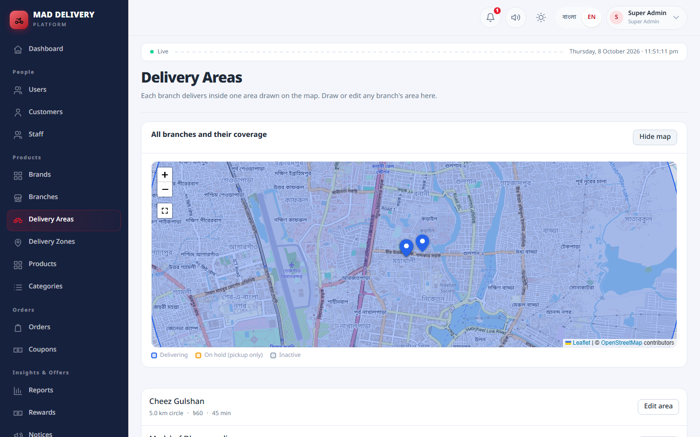

### ধাপে ধাপে
1. Super Admin-এর পেজে **Show map** চাপলে সব ব্রাঞ্চের এলাকা একসাথে দেখা যায় (কোথায় একটা আরেকটার ওপর পড়ছে বোঝা যায়)। নিচে প্রতি ব্রাঞ্চের সারি: কত কিমি, চার্জ, সময়।
2. **Edit area** চাপুন। এলাকা আঁকার তিন উপায়: **Start from a circle** (সবচেয়ে সহজ), **Reshape by points** (বৃত্তকে টেনে আকার বদলানো), **Draw from scratch** (নিজে বিন্দু দিয়ে আঁকা)।
3. বৃত্তের জন্য **Radius** স্লাইডার টানুন। পাশে লাইভ লেখা দেখাবে, যেমন "5 km radius"। সর্বোচ্চ সীমা = ব্রাঞ্চের সেটিংসের "Delivery Radius"।

   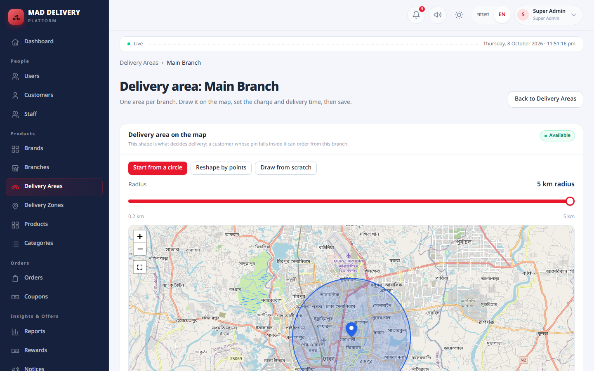

4. নিচে **Delivery charge**, **Delivery time (min)**, এলাকা চালু কি না → **Save Changes**।
5. **Delivery status:** পুরো এলাকা সাময়িক বন্ধ (শুধু pickup) করতে কারণ লিখে **Hold Delivery**। আবার চালু করতে **Resume Delivery**।
6. **Temporary blocks:** ম্যাপে যেখানে যাওয়া যাচ্ছে না সেখানে ট্যাপ করুন → **Block size** স্লাইডারে আকার ঠিক করুন → কারণ (ঐচ্ছিক) → **Ends (optional)** এ শেষ হওয়ার সময় (ঢাকার সময়; খালি রাখলে আপনি নিজে না সরানো পর্যন্ত থাকবে) → **Block this part**।
7. ব্লক সরাতে তালিকায় **Remove block**। শেষ সময় পার হলে নিজে থেকেই উঠে যায়।

   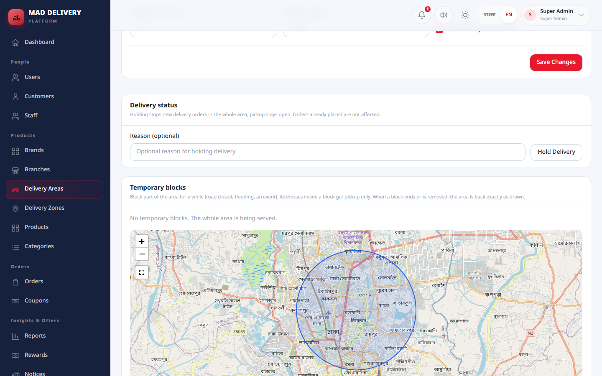

Branch Manager-এর পেজ একই রকম, শুধু নিজের ব্রাঞ্চ:

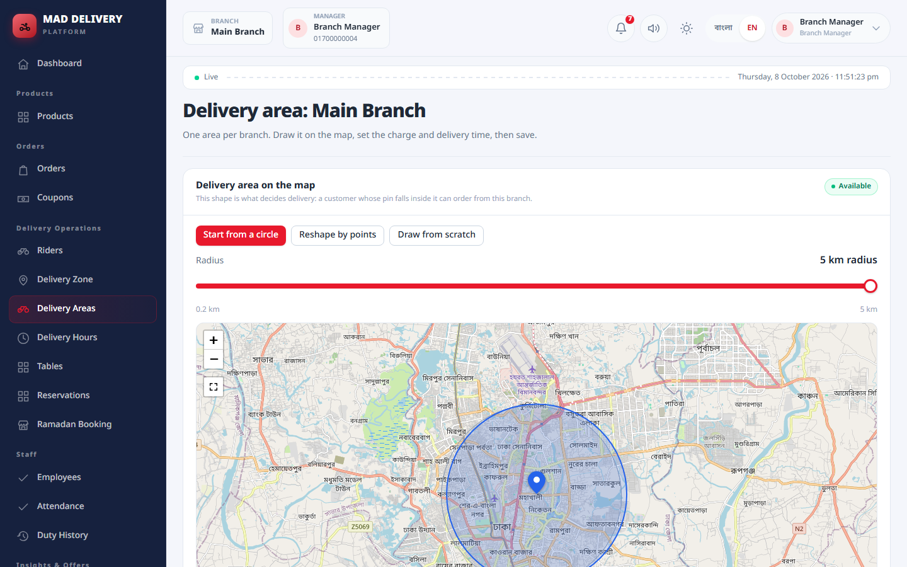

### সব জায়গায় কীভাবে মেলে
সেভ করার সাথে সাথে চেকআউট, My Addresses-এর "আমরা কি এখানে ডেলিভারি দিই" যাচাই আর নিকটতম ব্রাঞ্চ বাছাই নতুন এলাকা ব্যবহার করে। একটা পিন দুই ব্রাঞ্চের এলাকায় পড়লে কাছেরটা (যেটা খোলা) ডিফল্ট হয়, কাস্টমার চাইলে বদলাতে পারেন। আগের অর্ডারে যে চার্জ ও সময় লেখা ছিল সেটা বদলায় না। প্রতিটা পরিবর্তন (এলাকা, hold, block) **Activity Logs**-এ ওঠে।

### টেস্ট চেকলিস্ট
1. Super Admin → **Delivery Areas**। **প্রত্যাশিত:** প্রতি চালু ব্রাঞ্চের একটা সারি, এলাকা না থাকলে "No shape drawn" আর **Draw area**।
2. Main Branch → **Edit area** → স্লাইডার ৩ কিমি-তে আনুন। **প্রত্যাশিত:** লেখা সাথে সাথে "3 km radius", ম্যাপের বৃত্ত ছোট হয়।
3. **Save Changes** → তালিকায় ফিরুন। **প্রত্যাশিত:** "3.0 km circle"।
4. Branch Manager দিয়ে **Delivery Areas** খুলুন। **প্রত্যাশিত:** একই এলাকা, একই ৩ কিমি।
5. Main Branch-এর কাছে একটা Temporary block দিন। Customer দিয়ে ঐ জায়গায় পিন রেখে ঠিকানা যোগ করুন। **প্রত্যাশিত:** "Delivery here is paused right now…" জাতীয় লেখা; চেকআউটে শুধু pickup।
6. **Remove block** → আবার চেষ্টা করুন। **প্রত্যাশিত:** ডেলিভারি আবার পাওয়া যায়।
7. **Hold Delivery** → Customer চেকআউট। **প্রত্যাশিত:** ঐ ব্রাঞ্চে শুধু pickup। পরীক্ষা শেষে **Resume Delivery**।
8. **যা হওয়া উচিত নয়:** কোনো ব্রাঞ্চে দ্বিতীয় এলাকা বানানো যাবে না।
9. **যা হওয়া উচিত নয়:** এলাকার "Area name" ঘর বা Day/Night shift আর দেখা যাবে না।
10. **যা হওয়া উচিত নয়:** Branch Manager অন্য ব্রাঞ্চের এলাকা বদলাতে পারবেন না।
11. **যা হওয়া উচিত নয়:** ব্রাঞ্চের Delivery Radius-এর চেয়ে বড় এলাকা সেভ হবে না।
12. **যা হওয়া উচিত নয়:** Archive করা ব্রাঞ্চের এলাকা Super Admin-এর ম্যাপে বা তালিকায় দেখাবে না।

---

## ৮. My Addresses ও ম্যাপে ঠিকানা বাছাই

### কী ও কেন
আগে ঠিকানা যোগ করার ফর্ম জটিল ছিল, আর "Manual" মোডে ম্যাপ হারিয়ে যেত বলে ঠিকানা সেভই হতো না। এখন দুটো পরিষ্কার উপায়:
- **Pick on map** (সুপারিশকৃত): "Use my current location" বা সার্চ বা পিন টেনে আনা; ঠিকানার লেখা নিজে নিজে ভরে যায়।
- **Enter manually**: ঠিকানা হাতে লিখুন, তারপর **Find on map** দিয়ে পিন বসান (রাইডারের জন্য পিন লাগবেই)।

সেভ করার আগেই অ্যাপ জানিয়ে দেয় ঐ জায়গায় কোনো ব্রাঞ্চ ডেলিভারি দেয় কি না।

### কে, কোথায়
**Customer** → বাঁ মেনু → **Account** অংশে **Addresses** → **New Address**

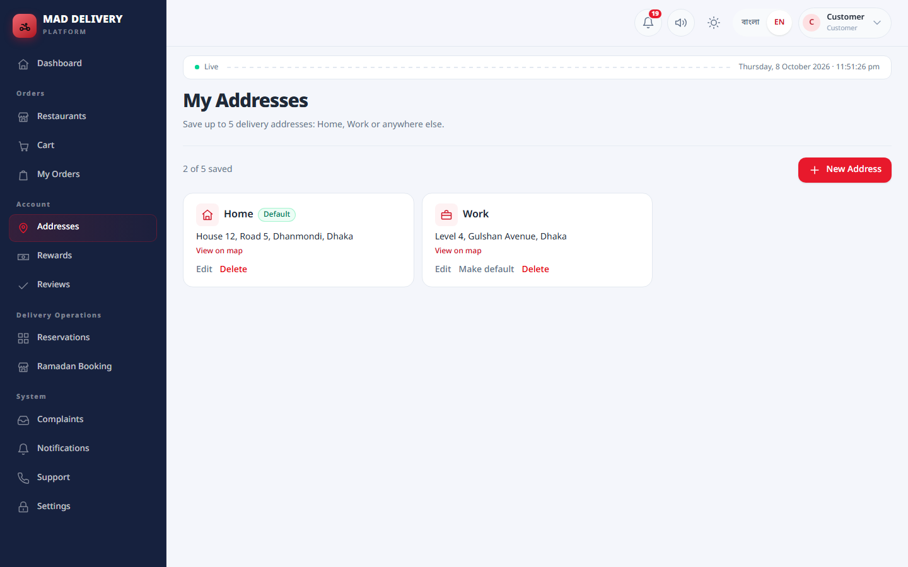

### ধাপে ধাপে: Pick on map
1. **New Address** চাপুন। **Pick on map** ট্যাব খোলা থাকে।
2. সবার ওপরে লাল বাটন **Use my current location**। চাপলে ব্রাউজার লোকেশনের অনুমতি চাইবে → Allow।
3. অথবা "Search your area or address" ঘরে এলাকা লিখে বাছুন, অথবা ম্যাপে পিন টেনে দরজার কাছে আনুন।
4. ঠিকানার লেখা নিজে ভরে যাবে (Barikoi দিয়ে)।
5. Label বাছুন: **Home**, **Work** বা **Other** (Other-এর নাম দেওয়া ঐচ্ছিক)।
6. চাইলে এক লাইনে **Flat, floor or landmark (optional)** লিখুন (যেমন "Flat 4B, লিফটের ৫ তলা")।
7. **Confirm location** চাপুন। ঠিকানা সেভ।

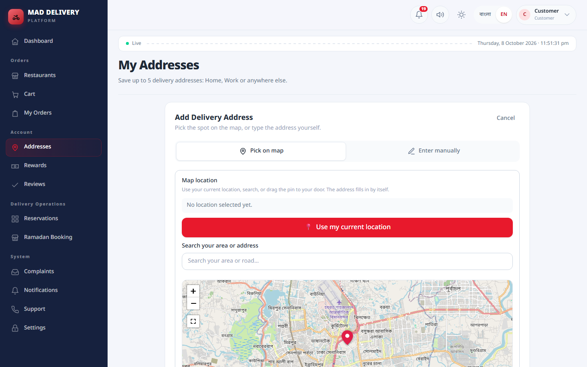

### ধাপে ধাপে: Enter manually
1. **Enter manually** ট্যাব → **Area** (বাধ্যতামূলক), Road / lane, House / plot।
2. **Find on map** চাপুন: লেখা ঠিকানা থেকে পিন বসে। ভুল জায়গায় পড়লে টেনে ঠিক করুন, বা ম্যাপে ট্যাপ করুন।
3. Label আর Flat/floor/landmark দিন → **Save address**।

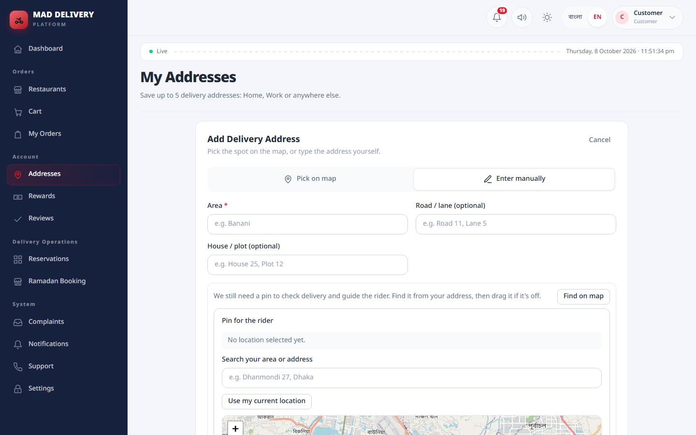

### সব জায়গায় কীভাবে মেলে
সেভ করা ঠিকানা চেকআউটের ঠিকানা তালিকায় সাথে সাথে আসে। পিন দিয়েই ঠিক হয় কোন ব্রাঞ্চ ডেলিভারি দেবে (অধ্যায় ৭)। রাইডার অর্ডারে এই ঠিকানা আর পিন দেখেন। সর্বোচ্চ ৫টা ঠিকানা; পেজে লেখা থাকে "2 of 5 saved"। চেকআউটে একবারের জন্য ভিন্ন ঠিকানা দেওয়ার উপায় আগের মতোই আছে।

### টেস্ট চেকলিস্ট
1. **New Address** → **Pick on map** → ঢাকার ভেতরে পিন রাখুন। **প্রত্যাশিত:** ঠিকানা নিজে ভরে যায় (Barikoi key থাকলে), আর লেখা আসে "<ব্রাঞ্চ> delivers here."
2. Label **Work**, Flat ঘরে কিছু লিখে **Confirm location**। **প্রত্যাশিত:** তালিকায় Work কার্ড, ঠিকানার শুরুতে আপনার Flat লেখা।
3. ঢাকার অনেক বাইরে (যেমন চট্টগ্রাম) পিন রাখুন। **প্রত্যাশিত:** হলুদ সতর্কবার্তা "This address is outside every branch's delivery area…", তবু সেভ করা যায় (pickup-এর জন্য)।
4. **Enter manually** → Area লিখে **Find on map**। **প্রত্যাশিত:** পিন বসে, ম্যাপ হারিয়ে যায় না; **Save address** সফল।
5. ৫টা ঠিকানা হয়ে গেলে। **প্রত্যাশিত:** **New Address** নিষ্ক্রিয়, লেখা "You have 5 saved addresses, the most allowed…"
6. চেকআউটে যান। **প্রত্যাশিত:** নতুন ঠিকানাগুলো তালিকায় আছে।
7. **যা হওয়া উচিত নয়:** পিন ছাড়া ঠিকানা সেভ হবে না (পরিষ্কার মেসেজ আসবে)।
8. **যা হওয়া উচিত নয়:** Addresses পেজে পুরনো "live location" কার্ড আর থাকবে না।
9. **যা হওয়া উচিত নয়:** **Enter manually**-তে গেলে ম্যাপ উধাও হয়ে যাবে না।

---

## ৯. Product Reviews (খাবারের রিভিউ)

### কী ও কেন
যে কাস্টমার খাবারটা সত্যিই পেয়েছেন (Delivered বা Collected), শুধু তিনিই রিভিউ দিতে পারেন। এক খাবারে একজনের একটাই রিভিউ, পরে বদলানো যায়। ১ থেকে ৫ তারা, লেখা আর সর্বোচ্চ ৩টা ছবি। রিভিউ সাথে সাথে প্রকাশ হয়। Marketing বা Super Admin খারাপ রিভিউ (স্প্যাম, গালি, অপ্রাসঙ্গিক) লুকাতে পারেন। Branch Manager শুধু "flag" করে Marketing-কে জানাতে পারেন।
অন্যরা শুধু কাস্টমারের নামের প্রথম অংশ আর ছবি দেখেন; ফোন, ইমেইল কখনো দেখায় না।

### কে, কোথায়
- **Customer:** **My Orders** → Delivered/Collected অর্ডার খুলুন → নিচে **Rate your items**। ডেলিভারির পর নোটিফিকেশনেও আমন্ত্রণ আসে।
- **সবাই (লগইন ছাড়াও):** হোমপেজের প্রোডাক্ট কার্ডে তারা, প্রোডাক্টে ক্লিক করলে জানালায় **Reviews** অংশ।
- **Marketing:** **Customer** অংশে **Product Reviews**
- **Super Admin:** **Customer** অংশে **Product Reviews**
- **Branch Manager:** **Customer** অংশে **Product Reviews** (শুধু নিজের ব্রাঞ্চ)

### ধাপে ধাপে: কাস্টমার
1. ডেলিভারি হওয়া অর্ডার খুলুন, নিচে নামুন: **Rate your items**। অর্ডারের প্রতিটা খাবারের আলাদা কার্ড।
2. তারা দিন, চাইলে লেখা আর ছবি (৩টা পর্যন্ত) → **Publish review**।
3. পরে বদলাতে একই জায়গায় আগের রিভিউ ভরা থাকবে → বদলে **Update review**।

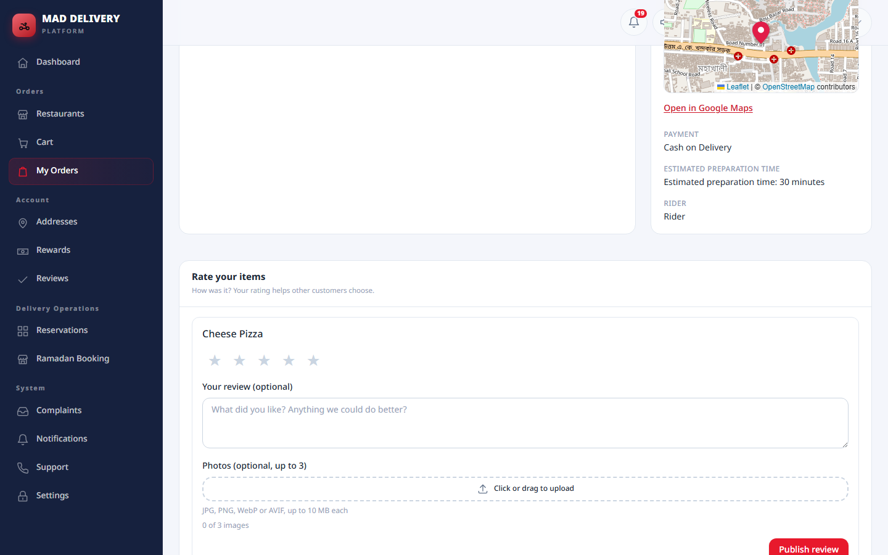

### যেখানে রিভিউ দেখা যায়
- প্রোডাক্ট কার্ডে খাবারের নামের নিচে: ★ 5.0 (1), মানে গড় তারা আর রিভিউ সংখ্যা।

  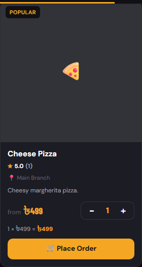

- প্রোডাক্টে ক্লিক করলে জানালার নিচে **Reviews**: গড়, ৫ থেকে ১ তারার ভাগ, রিভিউ তালিকা। বেশি থাকলে **See all reviews**।

  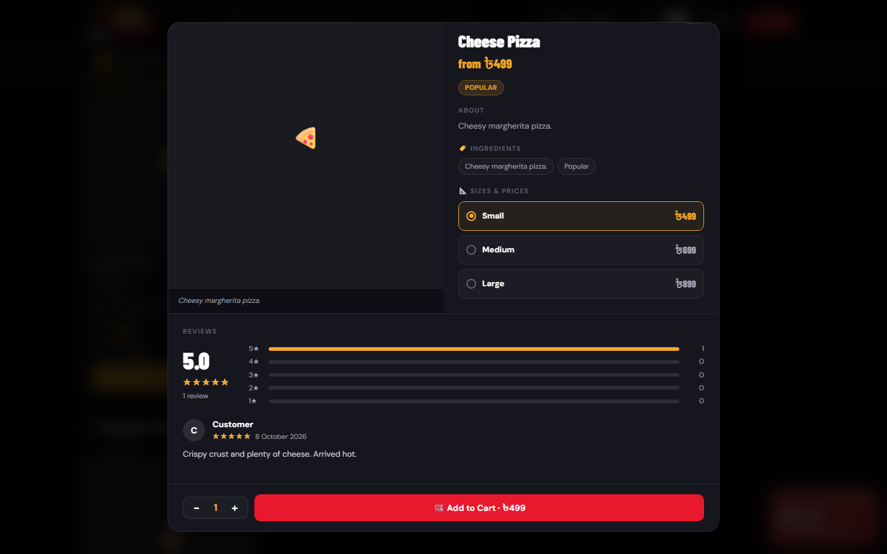

### ধাপে ধাপে: Marketing / Super Admin (মডারেশন)
1. **Product Reviews** পেজে ফিল্টার: ব্রাঞ্চ, ব্র্যান্ড, তারা, দেখা/লুকানো, flag করা কি না → **Apply**।
2. খারাপ রিভিউ: **Hide** → কারণ লিখুন। লুকানো রিভিউ কাস্টমাররা দেখেন না, গড় তারাতেও গোনা হয় না।
3. ফিরিয়ে আনতে **Restore**।
4. Branch Manager flag করা রিভিউ দেখতে ফিল্টারে **Flagged only**।

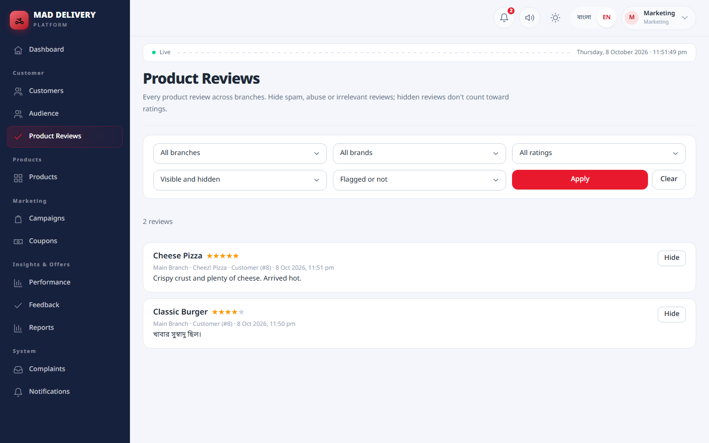

### ধাপে ধাপে: Branch Manager
1. **Product Reviews**-এ নিজের ব্রাঞ্চের রিভিউ দেখা যায়।
2. সন্দেহজনক রিভিউতে **Flag for marketing** → কী দেখতে হবে লিখুন (ঐচ্ছিক)। Marketing টিম নোটিফিকেশন পায়।
3. Branch Manager নিজে লুকাতে পারেন না।

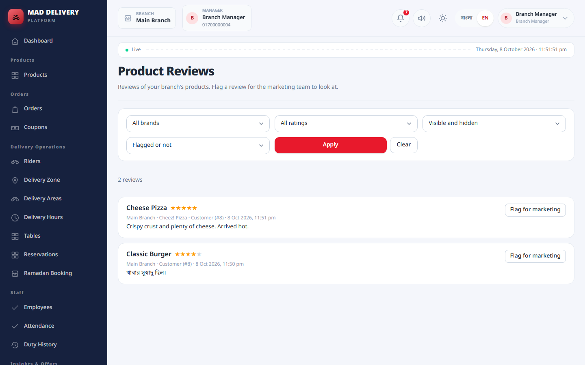

### সব জায়গায় কীভাবে মেলে
রিভিউ প্রকাশ, বদল, লুকানো বা ফেরানো হলে পেজ রিফ্রেশ করলেই কার্ডের তারা, প্রোডাক্ট জানালা আর ম্যানেজমেন্ট পেজ সব একসাথে বদলায়। লুকানো বা ফেরানো **Activity Logs**-এ ওঠে। লুকালে বা ফেরালে রিভিউর তারিখ বদলায় না, আর "edited" দেখায় না।

### টেস্ট চেকলিস্ট
1. Customer → Delivered অর্ডার → **Rate your items** → ৫ তারা, লেখা, একটা ছবি → **Publish review**। **প্রত্যাশিত:** সফল; লগআউট করে হোমপেজে কার্ডে ★ আর সংখ্যা।
2. প্রোডাক্টে ক্লিক। **প্রত্যাশিত:** জানালায় রিভিউ, শুধু নামের প্রথম অংশ।
3. আবার **Rate your items** → ৪ তারা → **Update review**। **প্রত্যাশিত:** একটাই রিভিউ, এখন ৪ তারা, পাশে "edited"।
4. Branch Manager → **Flag for marketing**। **প্রত্যাশিত:** Marketing-এর নোটিফিকেশনে আসে; ফিল্টারে **Flagged only** দিলে দেখা যায়।
5. Marketing → **Hide** (কারণসহ)। **প্রত্যাশিত:** কার্ডের সংখ্যা কমে, জানালায় রিভিউ নেই। তারপর **Restore** → আবার দেখা যায়।
6. **যা হওয়া উচিত নয়:** যে খাবার কাস্টমার পাননি (বা অর্ডার এখনো Delivered হয়নি), তার রিভিউ দেওয়া যাবে না।
7. **যা হওয়া উচিত নয়:** একই খাবারে দ্বিতীয় রিভিউ তৈরি হবে না (আগেরটাই বদলায়)।
8. **যা হওয়া উচিত নয়:** Branch Manager-এর পেজে **Hide** থাকবে না; Marketing-এর পেজে **Flag** থাকবে না।
9. **যা হওয়া উচিত নয়:** রিভিউতে কাস্টমারের ফোন বা ইমেইল দেখাবে না।
10. **যা হওয়া উচিত নয়:** ৩টার বেশি ছবি দেওয়া যাবে না।

---

## ১০. Complaints (অভিযোগ)

### কী ও কেন
কাস্টমারের অভিযোগ এখন সরাসরি **যে ব্রাঞ্চ অর্ডারটা দিয়েছিল তার Manager**-এর কাছে যায়, অন্য কারো কাছে না। ঐ ব্রাঞ্চে Manager না থাকলে, বা কোনো অর্ডার বাছাই না করলে, অভিযোগ Super Admin (সাপোর্ট টিম) পান। নতুন বিভাগ **Rider behavior** আর **Other**, আর ৫টা পর্যন্ত ছবি।

### কে, কোথায়
- **Customer:** **System** অংশে **Complaints** → **New Complaint**
- **Branch Manager:** **Customer** অংশে **Complaints** (নিজের ব্রাঞ্চের)
- **Super Admin:** **Customer** অংশে **Complaints** (সব)

### ধাপে ধাপে: কাস্টমার
1. **Recipient** ঘরে লেখা "Branch Manager", এটা বদলানো যায় না। নিচে লেখা থাকে অভিযোগটা ঠিক কোথায় যাবে, যেমন "Goes to: Main Branch manager"।
2. **Related order**: আপনার অর্ডারগুলো, নতুনটা আগে, এভাবে: "#6 · Today, 11:46 PM · ৳704" (ঢাকার সময়)। অর্ডার বদলালে "Goes to" লাইনও বদলায়।
3. **Category** বাছুন (Food Quality, Delivery, Service, Payment, App, Rider behavior, Other)।
4. **Subject** আর **Details** লিখুন, চাইলে ছবি (৫টা পর্যন্ত) → **Submit Complaint**।

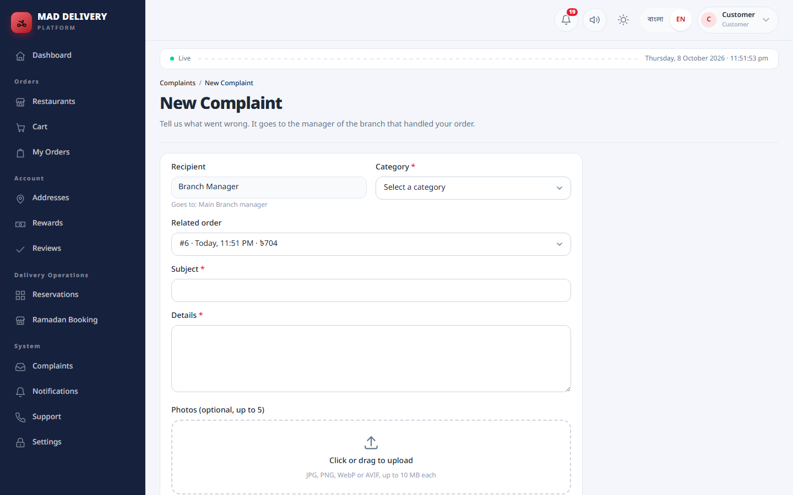

### ধাপে ধাপে: Branch Manager / Super Admin
1. **Complaints** পেজে সংখ্যা (Total, Pending, In Progress, Resolved, Closed) আর তালিকা।
2. অভিযোগ খুলে বিস্তারিত ও ছবি দেখুন, স্ট্যাটাস বদলান, উত্তর দিন।

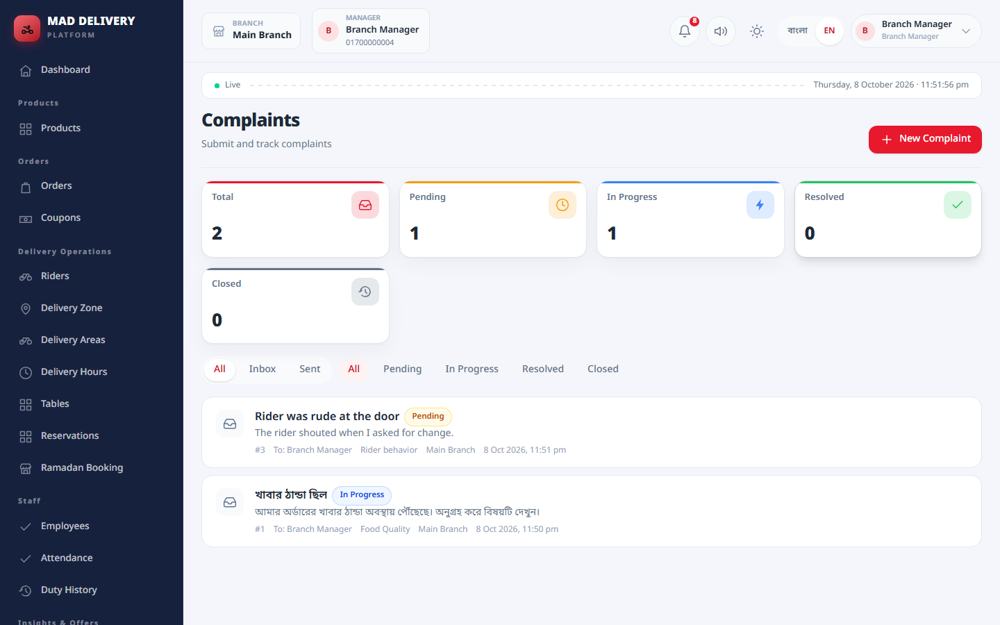

### সব জায়গায় কীভাবে মেলে
জমা দেওয়ার সাথে সাথে শুধু ঐ ব্রাঞ্চের Manager (আর Super Admin) নোটিফিকেশন পান। স্ট্যাটাস বদলালে কাস্টমারের Complaints তালিকায় দেখায়। ছবিগুলো প্রাইভেট: শুধু কাস্টমার নিজে, ঐ ব্রাঞ্চের Manager আর Super Admin দেখতে পারেন।

### টেস্ট চেকলিস্ট
1. Customer → **New Complaint**। **প্রত্যাশিত:** "Goes to: Main Branch manager" (ডেমোতে সব অর্ডার Main Branch-এর হলে)।
2. **Related order**-এ **No order** বাছুন। **প্রত্যাশিত:** "Goes to: our support team (no order selected)"।
3. Category **Rider behavior**, ২টা ছবি দিয়ে জমা দিন। **প্রত্যাশিত:** সফল; Branch Manager-এর নোটিফিকেশন আর Complaints তালিকায় আসে, ছবি খোলে।
4. Manager ছাড়া একটা ব্রাঞ্চের অর্ডার নিয়ে অভিযোগ দিন (থাকলে)। **প্রত্যাশিত:** "Goes to: our support team (<ব্রাঞ্চ> has no branch manager assigned yet)"; Super Admin পান।
5. **যা হওয়া উচিত নয়:** অন্য ব্রাঞ্চের Manager এই অভিযোগ বা এর ছবি দেখতে পারবেন না।
6. **যা হওয়া উচিত নয়:** কাস্টমার Recipient বদলে Marketing বা অন্য কাউকে পাঠাতে পারবেন না।
7. **যা হওয়া উচিত নয়:** ৫টার বেশি ছবি, বা ছবি নয় এমন ফাইল দেওয়া যাবে না।

---

## ১১. ছবি আপলোডের নতুন ঘর

### কী ও কেন
আগে প্রতিটা ফর্মে ব্রাউজারের সাধারণ "Choose file" বাটন ছিল, দেখতে আলাদা আলাদা। এখন সব জায়গায় একই ধরনের ঘর: "Click or drag to upload", ছবির প্রিভিউ, × দিয়ে সরানো, কয়টা দেওয়া হলো তার গণনা, আর ভুল ফাইল দিলে সাথে সাথে পরিষ্কার মেসেজ।

### কোথায় কোথায়
প্রোডাক্টের ছবি, ব্র্যান্ড লোগো, কোম্পানি লোগো (Settings), ব্রাঞ্চ লোগো, প্রোফাইল ছবি, কর্মচারীর ছবি, রমজান মেনুর ছবি, রাইডার রেজিস্ট্রেশনের NID ও লাইসেন্স, রিভিউর ছবি (৩টা), অভিযোগের ছবি (৫টা)।
অর্ডার চ্যাটের ক্যামেরা বাটন আগের মতোই আছে (চ্যাটে বড় ঘর জায়গা নষ্ট করত)।

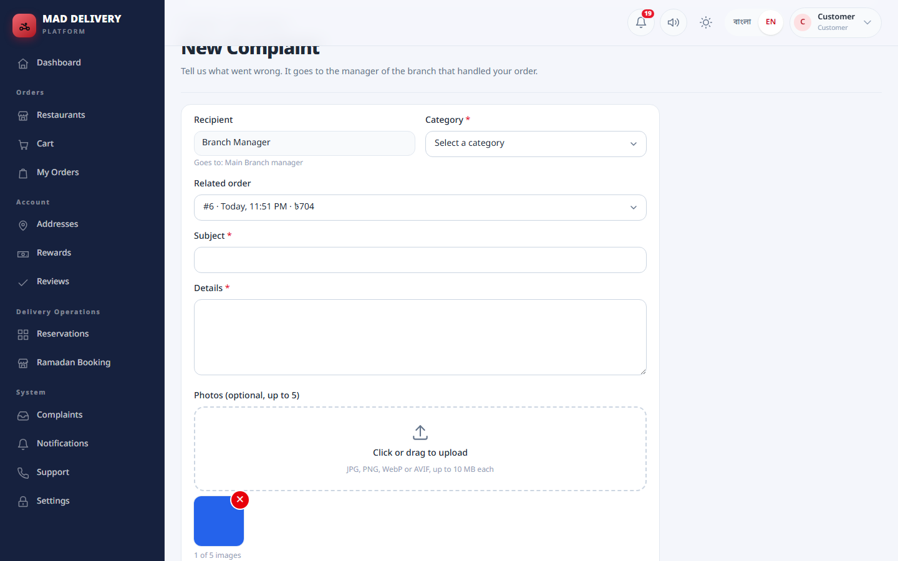

### ধাপে ধাপে
1. ঘরে ক্লিক করে ছবি বাছুন, অথবা ফাইল টেনে এনে ঘরে ছেড়ে দিন।
2. নিচে প্রিভিউ আসে; ভুল হলে প্রিভিউর লাল × চাপুন।
3. গ্রহণযোগ্য: JPG, PNG, WebP, AVIF। আকারের সীমা ঘরের নিচে লেখা থাকে (চ্যাট/রিভিউ/অভিযোগে প্রতি ছবি ১০ MB)।

### টেস্ট চেকলিস্ট
1. অভিযোগের ফর্মে একটা ছবি দিন। **প্রত্যাশিত:** প্রিভিউ আর "1 of 5 images"।
2. একটা PDF বা টেক্সট ফাইল দিন। **প্রত্যাশিত:** সাথে সাথে লাল মেসেজ, ফাইল নেয় না।
3. Super Admin → **Brands** → **Edit** → লোগো বদলে সেভ। **প্রত্যাশিত:** হোমপেজে নতুন লোগো।
4. **যা হওয়া উচিত নয়:** কোনো ফর্মে পুরনো ধূসর "Choose file / No file chosen" বাটন দেখা যাবে না (অর্ডার চ্যাট বাদে)।
5. **যা হওয়া উচিত নয়:** সীমার চেয়ে বেশি ছবি যোগ করা যাবে না।

---

## ১২. Notifications (ডার্ক মোডসহ)

### কী ও কেন
ডার্ক মোডে না-পড়া নোটিফিকেশনের পটভূমি প্রায় সাদা হয়ে লেখা পড়া যেত না। এখন ডার্ক মোডে না-পড়া সারি গাঢ় লালচে আভা, বাঁ দিকে লাল দাগ আর লাল বিন্দু; লাইট মোডেও বাঁ দিকের দাগ আছে, তাই পড়া আর না-পড়া সহজে আলাদা করা যায়।

### কে, কোথায়
সব রোল: ওপরের ঘণ্টা আইকন, অথবা বাঁ মেনু → **System** অংশে **Notifications**। থিম বদলাতে ওপরের সূর্য/চাঁদ আইকন।

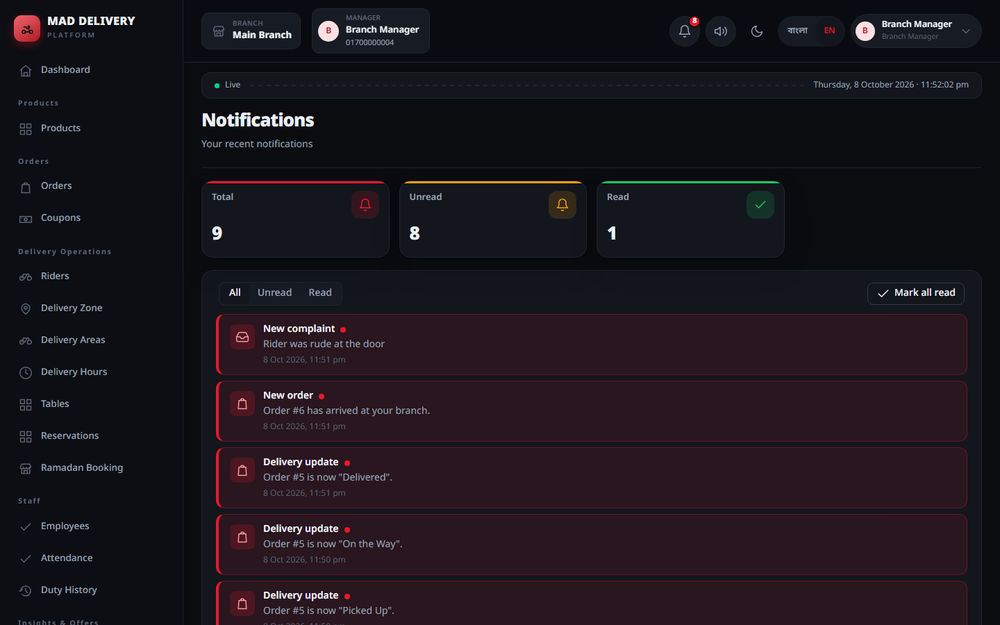

### টেস্ট চেকলিস্ট
1. ওপরের চাঁদ/সূর্য আইকন দিয়ে ডার্ক মোড চালু করুন → **Notifications**। **প্রত্যাশিত:** না-পড়া সারির লেখা স্পষ্ট পড়া যায়।
2. **Unread** ফিল্টার। **প্রত্যাশিত:** শুধু না-পড়া।
3. **Mark all read**। **প্রত্যাশিত:** সব সারি সাধারণ রঙে, ঘণ্টার লাল সংখ্যা চলে যায়।
4. **যা হওয়া উচিত নয়:** ডার্ক মোডে কোনো সারি সাদা বা প্রায় সাদা পটভূমিতে হালকা লেখা নিয়ে দেখাবে না।

---

## ১৩. হোমপেজ: Call to order, Operating Hours, Night Pickup Points

### কী ও কেন
হোমপেজের এই অংশগুলো আগে হাতে লেখা ছিল (যেমন নির্দিষ্ট কিছু pickup জায়গার তালিকা আর "10:15 PM")। এখন সবকিছু ব্রাঞ্চের আসল সময়সূচি থেকে আসে (অধ্যায় ৫), তাই হোমপেজ কখনো আসল নিয়মের উল্টো কথা বলে না।

- **Call to order** ব্যানার: আজ সবচেয়ে আগে কখন খোলে থেকে সবচেয়ে দেরিতে কখন বন্ধ, কয়টা ব্রাঞ্চ, আর প্রতি ব্র্যান্ড কতক্ষণ ডেলিভারি দেয়।

  

- **Operating Hours:** কোন ব্রাঞ্চ কখন খোলে, প্রতি ব্র্যান্ডের আজকের dine-in, ডেলিভারি আর pickup সময়।
- **Late-Night Delivery:** যেসব ব্রাঞ্চ মধ্যরাতের পরও ডেলিভারি দেয়।
- **Night Pickup Points:** যেসব ব্রাঞ্চে আজ রাত ১১টা বা তার পরেও pickup অর্ডার নেওয়া হয়। প্রতিটার নাম, pickup ঠিকানা আর "Pickup until …"। এমন কোনো ব্রাঞ্চ না থাকলে পুরো অংশটাই লুকানো থাকে।

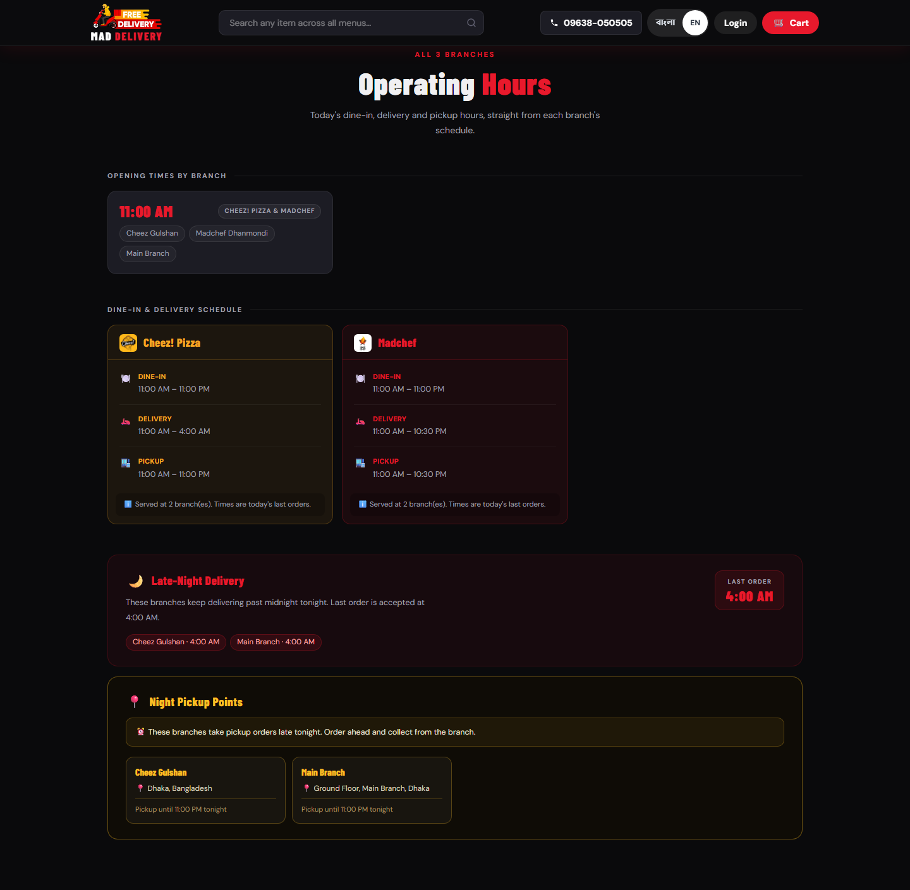

### কে, কোথায়
সবাই (লগইন ছাড়াও): হোমপেজে নিচে নামুন। বদলাতে হলে Branch Manager বা Super Admin সময়সূচি বদলান (অধ্যায় ৫); এখানে আলাদা কোনো সেটিং নেই।

### টেস্ট চেকলিস্ট
1. হোমপেজের **Call to order**। **প্রত্যাশিত:** সময় আর ব্রাঞ্চ সংখ্যা Delivery Hours-এর সাথে মেলে।
2. Main Branch-এ Cheez-এর pickup রাত ১১টা পর্যন্ত রাখুন। **প্রত্যাশিত:** **Night Pickup Points**-এ Main Branch, "Pickup until 11:00 PM tonight"।
3. সব ব্রাঞ্চের pickup রাত ১০টায় শেষ করুন। **প্রত্যাশিত:** **Night Pickup Points** অংশটাই নেই। পরীক্ষা শেষে সময় আগের মতো করুন।
4. **যা হওয়া উচিত নয়:** পুরনো স্থির তালিকা (Mirpur DOHS, Mohakhali DOHS, Cantonment ইত্যাদি) আর দেখাবে না।
5. **যা হওয়া উচিত নয়:** pickup যদি ডেলিভারির আগেই বন্ধ হয়, তাহলে "ডেলিভারি শেষে pickup করুন" ধরনের লেখা আসবে না।

---

## ১৪. অন্যান্য ছোট পরিবর্তন

- **Dashboard-এর "Delivering" সংখ্যা:** আগে কিছু ড্যাশবোর্ডে "NaN" দেখাত (পুরনো "Delayed" স্ট্যাটাসের কারণে)। এখন ঠিক সংখ্যা দেখায়।
- **"Delayed" স্ট্যাটাসের অবশিষ্ট অংশ** তালিকা ও ফিল্টার থেকে সরানো হয়েছে। Rider-এর **Report Delay** বাটন আছে (অধ্যায় ৬)।
- **পুরনো "time slots"** (শুধু লেবেল ছিল, কাজে লাগত না) পুরোপুরি সরানো হয়েছে। এখন সময় ঠিক করে শুধু Delivery Hours।
- **অনুবাদ:** কিছু জায়গায় ইংরেজি/বাংলা লেখার বদলে কোড-নাম (যেমন `branches.radiusN`) দেখাত, সেগুলো ঠিক করা হয়েছে।
- **Delivery Zone(s) বনাম Delivery Areas:** মেনুতে **Delivery Zones** (Super Admin) আর **Delivery Zone** (Branch Manager) আলাদা জিনিস। এটা এলাকার নামের তালিকা আর ব্রাঞ্চের প্রোফাইলের জন্য। **কে ডেলিভারি পাবে সেটা ঠিক করে শুধু Delivery Areas-এর ম্যাপ।**

---

## ১৫. জানা সীমাবদ্ধতা, স্থগিত কাজ ও আগে থেকেই ফেল করা টেস্ট

### জানা সীমাবদ্ধতা
- **ঠিকানা নিজে ভরা** আর **ঠিকানা সার্চ** কাজ করে শুধু `BARIKOI_API_KEY` থাকলে। না থাকলে হাতে লিখতে হয়, আর পিন ম্যাপে ট্যাপ করে বসাতে হয়।
- **"Use my current location"** ব্রাউজারের অনুমতি লাগে, আর শুধু `localhost` বা HTTPS সাইটে কাজ করে।
- **Night Pickup Points** এখন শুধু ব্রাঞ্চ দেখায়। আগের নির্দিষ্ট pickup জায়গাগুলো (DOHS ইত্যাদি) ফেরত চাইলে আলাদা ডাটা মডেল বানাতে হবে।
- **"Crust & size guide"**-এর লেখা (পিৎজার সাইজ) এখনো কোডে লেখা; ব্র্যান্ড শুধু ঠিক করে দেখাবে কি না।
- **অর্ডার চ্যাটের ছবি** ব্রাউজারে ৫ মিনিট পর্যন্ত ক্যাশ থাকে। একই কম্পিউটারে একজন লগআউট করে আরেকজন ঢুকলে অল্প সময়ের জন্য আগের জনের চ্যাট ছবি ক্যাশ থেকে দেখা যেতে পারে। (অভিযোগের ছবিতে এই সমস্যা ঠিক করা হয়েছে; চ্যাটেরটা আগে থেকেই ছিল, পরে ঠিক করার জন্য রাখা।)
- **টেমপোরারি ব্লক** শেষ সময় পার হলে পরের যাচাইয়ে নিজে থেকেই উঠে যায়; আলাদা কোনো ব্যাকগ্রাউন্ড কাজ নেই, তাই তালিকায় পেজ রিফ্রেশ করলে বদলটা দেখা যায়।

### স্থগিত (on hold) কাজ
- **Staff roles:** কর্মচারীদের জন্য আলাদা আলাদা অনুমতির রোল। এখনো শুরু হয়নি।
- **Firebase push notification:** মোবাইলে/ব্রাউজারে পুশ নোটিফিকেশন। এখন শুধু অ্যাপের ভেতরের নোটিফিকেশন (ঘণ্টা আইকন)।
- **WebRTC calling:** অ্যাপের ভেতর থেকে সরাসরি কল। এখন "Call branch" / "Call customer" বাটন সাধারণ ফোন কল খোলে।
- **Shared database:** Ash আর Robin-এর মেশিনে আলাদা `dev.db`, ইচ্ছে করেই। একজনের ডাটা আরেকজনের মেশিনে যায় না; কোড যায় git দিয়ে, ডাটা বদল যায় migration দিয়ে।

### আগে থেকেই ফেল করা টেস্ট (এই কাজের কারণে নয়)
এই কাজের পর E2E টেস্টের ফলাফল `main`-এর সাথে তুলনা করা হয়েছে (একই টেস্ট, `main`-এর কোডে আলাদাভাবে চালিয়ে)। নিচের টেস্টগুলো **`main`-এও একইভাবে ফেল করে**, তাই এগুলো নতুন সমস্যা নয়:

| টেস্ট | কী পরীক্ষা করে / কেন ফেল করে |
|---|---|
| `35-order-workflow` (লাইন ১৬৫) | এক ব্রাঞ্চের Manager অন্য ব্রাঞ্চের অর্ডার চালাতে পারেন কি না। `main`-এও ফেল করে; কারণ আলাদা করে খোঁজা হয়নি |
| `12-md-pdf-fixes` (লাইন ১৯৯) | ঠিকানার পাশের আইকন। `main`-এও ফেল করে; কারণ আলাদা করে খোঁজা হয়নি |
| `26` (লাইন ২৬৪) আর `29` (লাইন ৪৩৮) | `main`-এও ফেল করে; কারণ আলাদা করে খোঁজা হয়নি |
| `22-part-c-rider` C3 | ভুল ব্রাঞ্চের রাইডার দেওয়ার চেষ্টা। অ্যাপ ঠিকই আটকায়, কিন্তু টেস্ট এক ধরনের এরর কোড (400) আশা করে আর অ্যাপ আরেকটা (409) দেয় |
| `18` এর স্ক্রিনশট টেস্ট | পুরনো ছবির সাথে পিক্সেল মেলায়; ডিজাইন বদলেছে, ছবি নতুন করে তোলা হয়নি |
| `55`, `62`, `63`, `66`, `70`-এর কিছু টেস্ট | মূলত একই টেস্ট ডাটাবেস বারবার ব্যবহারে জমে থাকা পুরনো ডাটা, আর ব্যস্ত মেশিনে সময় শেষ হয়ে যাওয়া |

যদি এমন কোনো টেস্ট ফেল করে যা এই তালিকায় নেই, তাহলে সেটা নতুন সমস্যা হতে পারে। টেস্টের নাম আর এররের লেখা Ash-কে পাঠান।
